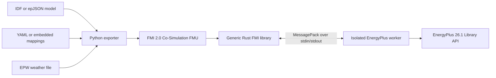
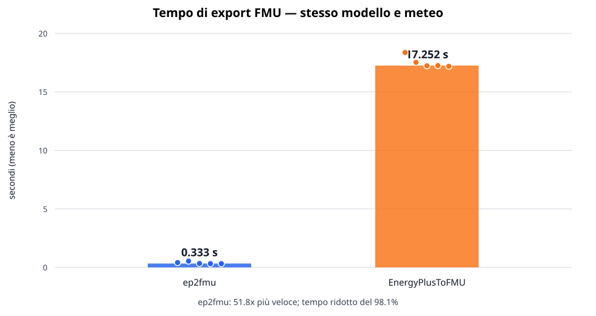

# ep2fmu

`ep2fmu` packages EnergyPlus building models as FMI 2.0 Co-Simulation FMUs.
It provides a Python exporter and a precompiled Rust runtime, so exporting a
model does not require compiling model-specific C or C++ code.

The project, simulation engine and interoperability standard have independent
versions:

| Component  | Supported version |
|------------|-------------------|
| ep2fmu     | 1.0.0             |
| EnergyPlus | 26.1.0            |
| FMI        | 2.0 Co-Simulation |
| Python     | 3.12 or newer     |

EnergyPlus is not embedded in the generated FMU. It must be installed on the
machine that runs the FMU. The provided Docker image includes the supported
EnergyPlus installation and can be used as a self-contained export
environment.

## Requirements

To use `ep2fmu` directly on the host, you need:

- Python 3.12 or newer;
- EnergyPlus 26.1.0 installed locally;
- access to the `energyplus` executable or an explicit `ENERGYPLUS_HOME`;
- a supported platform for the packaged runtime: Linux x64, Windows x64,
  macOS x64 or macOS arm64;
- a weather file in EPW format for every export or validation run;
- `uv` or `pipx` only if you want to install the CLI as a user tool.

If you build or test the project from source, you also need:

- Rust toolchain with `cargo`;
- the native build prerequisites required by the target platform.

For `build`, the model file must be an EnergyPlus `.idf` or `.epJSON` file and
the selected mappings must be resolvable against the model and its resources.
If you use the Docker image, the host only needs Docker.

## Features

- Accepts EnergyPlus `.idf` and `.epJSON` models.
- Uses the official EnergyPlus Library API and Data Transfer API.
- Produces FMI 2.0 Co-Simulation archives with deterministic GUIDs, value
  references, file order and timestamps.
- Requires no compiler during model export.
- Supports EnergyPlus output variables, meters, schedules, actuators and EMS
  global variables.
- Reads mappings from a versioned YAML sidecar or from embedded
  `ExternalInterface:FunctionalMockupUnitExport:*` objects.
- Keeps the source model unchanged and generates a dedicated runtime epJSON
  copy.
- Isolates every FMU instance in its own EnergyPlus worker process.
- Supports Linux x64, Windows x64, macOS x64 and macOS arm64 runtimes.
- Provides a CLI and a typed Python API.

## Architecture



The FMI library is generic and is renamed to the FMU `modelIdentifier` during
packaging. At runtime it starts one worker for each FMU instance. The worker
loads the EnergyPlus API dynamically and communicates with the FMI library
through length-prefixed MessagePack frames over standard pipes. Standard error
is reserved for diagnostic messages; no TCP ports or socket configuration
files are used.

## Installation

Use the path that matches your goal:

| Goal                                   | Command                       |
|----------------------------------------|-------------------------------|
| Add `ep2fmu` to another Python project | `uv add ep2fmu`               |
| Install the standalone CLI             | `uv tool install ep2fmu`      |
| Work on this repository locally        | `uv sync --extra dev`         |
| Run without local Python setup         | `docker run ... ep2fmu:1 ...` |

Install `ep2fmu` as a dependency in another project with `uv`:

```console
uv add ep2fmu
```

or with `pipx`:

```console
pipx install ep2fmu
```

Those commands resolve `ep2fmu` from a package registry. They only work when
the package has been published under that name. Use `uv tool install ep2fmu`
if you want the standalone CLI instead of a project dependency.

To work on a local checkout of this repository, sync the development
environment:

```console
uv sync --extra dev
```

or, for an editable install in another environment:

```console
uv pip install -e .
```

The `dev` extra includes the test and linting tools used by this repository.
It is the recommended choice when working on the codebase itself.

Set `ENERGYPLUS_HOME` to the EnergyPlus 26.1.0 installation directory:

```console
export ENERGYPLUS_HOME=/path/to/EnergyPlus-26-1-0
ep2fmu doctor
```

EnergyPlus is resolved in this order:

1. `--energyplus-home`;
2. `ENERGYPLUS_HOME`;
3. the `energyplus` executable available on `PATH`.

`doctor` verifies the executable, exact version and Library API:

```console
ep2fmu doctor
```

## Quick start

Validate a model and its mappings:

```console
ep2fmu validate building.idf --weather weather.epw
```

Build an FMU:

```console
ep2fmu build building.idf \
  --weather weather.epw \
  --output building.fmu
```

Inspect its metadata and contents:

```console
ep2fmu inspect building.fmu
```

An IDF is converted in a temporary directory with EnergyPlus
`--convert-only`. An epJSON model is copied directly into the temporary build
workspace. The source file is never modified. Files referenced through
EnergyPlus `file_name` fields are resolved relative to the source model,
included in the FMU and rewritten to portable FMU-local paths. This includes,
for example, `Construction:WindowDataFile` datasets and `Schedule:File` data.
Missing files and archive-name collisions are reported before packaging.

By default, the exporter includes every packaged runtime. Select one or more
targets when a smaller FMU is preferred:

```console
ep2fmu build building.epJSON \
  --weather weather.epw \
  --platform linux64 \
  --platform darwinarm64 \
  --output building.fmu
```

Valid platform selectors are `linux64`, `win64`, `darwin64` and
`darwinarm64`. FMI 2 uses the `darwin64` directory tuple for 64-bit macOS
binaries.

## Command-line interface

```text
ep2fmu build MODEL --weather FILE
    [--config FILE]
    [--energyplus-home DIR]
    [--output FILE]
    [--platform PLATFORM ...]

ep2fmu validate MODEL
    [--weather FILE]
    [--config FILE]
    [--energyplus-home DIR]

ep2fmu inspect FILE.fmu

ep2fmu doctor [--energyplus-home DIR]
```

CLI failures use stable exit codes:

| Code | Meaning                                       |
|-----:|-----------------------------------------------|
|    0 | Success                                       |
|    2 | Invalid model, configuration or command input |
|    3 | EnergyPlus installation not found             |
|    4 | Incompatible EnergyPlus version               |
|    5 | Invalid or unresolved mapping                 |
|    6 | FMU packaging failure                         |

## Declaring FMU variables

Mappings can be declared in a YAML sidecar named
`<model>.ep2fmu.yaml`, or supplied explicitly with `--config`.

```yaml
schema_version: 1

model:
  name: MyBuilding

inputs:
  - name: heatingSetpoint
    kind: schedule
    key: Heating Setpoint
    schedule_type_limits: Temperature
    start: 20.0
    unit: degC

  - name: shade
    kind: actuator
    key: Window 1
    component_type: Window Shading Control
    control_type: Control Status
    start: 0.0

  - name: command
    kind: ems_global
    key: ExternalCommand
    start: 0.0

outputs:
  - name: zoneTemperature
    kind: variable
    key: Zone 1
    variable: Zone Mean Air Temperature
    unit: degC

  - name: zoneHumidity
    kind: variable
    key: Zone 1
    variable: Zone Air Relative Humidity
    unit: percent

  - name: electricity
    kind: meter
    meter: Electricity:Facility
```

Schema version 1 exchanges input and output values as FMI `Real` variables.
Names must be unique across inputs and outputs. Optional `unit` fields are
included in `modelDescription.xml`.

### Mapping types

| Direction | Kind         | Required fields                                 | EnergyPlus API binding                            |
|-----------|--------------|-------------------------------------------------|---------------------------------------------------|
| Input     | `schedule`   | `name`, `key`, `schedule_type_limits`           | `Schedule:Constant` and `Schedule Value` actuator |
| Input     | `actuator`   | `name`, `key`, `component_type`, `control_type` | Direct actuator handle                            |
| Input     | `ems_global` | `name`, `key`                                   | EMS global variable handle                        |
| Output    | `variable`   | `name`, `key`, `variable`                       | Requested output-variable handle                  |
| Output    | `meter`      | `name`, `meter`                                 | Meter handle                                      |

Every input supports a numeric `start` value, defaulting to `0.0`.

### Model ownership and mapping responsibility

ep2fmu is an interface and packaging tool; it is not an EnergyPlus model
authoring system. The user is responsible for creating a valid EnergyPlus
model containing all zones, HVAC equipment, schedules, controls, EMS programs
and object relationships required by the intended simulation.

Mappings declared in YAML or through the embedded
`ExternalInterface:FunctionalMockupUnitExport:*` objects only expose selected
parts of that model through FMI:

- an output mapping reads an EnergyPlus variable or meter that the model
  actually produces;
- a schedule input creates or replaces a `Schedule:Constant`, but an
  EnergyPlus object such as a thermostat must reference that schedule for the
  input to affect the simulation;
- an actuator input does not create equipment or connections. The target
  object must already exist, be connected to the model and expose the exact
  actuator identified by `component_type`, `control_type` and `key`;
- an EMS global input creates the global variable when necessary, but an EMS
  program must read and apply it for the value to influence the model.

Consequently, a syntactically valid mapping may have no physical effect when
its target is unused or disconnected. Output variable names and meter names
can be taken from the EnergyPlus `.rdd` and `.mdd` dictionaries. Actuator
triples should be taken from the `.edd` actuator dictionary or the EnergyPlus
Data Transfer API catalogue.

The current `validate` command performs structural validation: it checks the
model version, YAML schema, duplicate names, required mapping fields and
epJSON transformation. It does not run EnergyPlus far enough to prove that
every runtime handle exists. Final handle resolution occurs when the FMU
worker initializes EnergyPlus. A misspelled output key or an unavailable
actuator can therefore pass `ep2fmu validate` and subsequently produce an
explicit FMU initialization error.

The exporter also recognizes these embedded EnergyPlus objects:

- `ExternalInterface:FunctionalMockupUnitExport:From:Variable`;
- `ExternalInterface:FunctionalMockupUnitExport:To:Actuator`;
- `ExternalInterface:FunctionalMockupUnitExport:To:Schedule`;
- `ExternalInterface:FunctionalMockupUnitExport:To:Variable`.

When both sources are present, a YAML entry replaces the embedded mapping with
the same FMU variable name. Duplicate names and incompatible mapping fields are
reported as errors.

The runtime epJSON omits the `ExternalInterface` FMU transport objects. It adds
the required constant schedules and EMS globals while preserving EMS actuator
aliases found in the model.

## Generated FMU

A generated archive follows the standard FMI 2.0 layout:

```text
model.fmu
├── modelDescription.xml
├── binaries/
│   └── <platform>/<modelIdentifier>.<library>
└── resources/
    ├── model.epJSON
    ├── ep2fmu-config.json
    ├── weather.epw
    ├── <referenced model resources>
    └── bin/<platform>/ep2fmu-worker
```

`modelDescription.xml` declares:

- `needsExecutionTool=true`;
- `canHandleVariableCommunicationStepSize=true`;
- `canBeInstantiatedOnlyOncePerProcess=false`;
- `canGetAndSetFMUstate=false`;
- `canSerializeFMUstate=false`.

Initial unknowns, output dependencies, units and start values are generated
from the resolved configuration.

## FMI runtime behavior

- FMI time starts at zero after EnergyPlus sizing and warm-up.
- Input start values are applied during sizing and warm-up.
- Inputs are written at the beginning of each EnergyPlus zone timestep.
- Outputs are read at the end of the zone timestep after reporting.
- `fmi2DoStep` accepts a zone timestep or an integer multiple of it.
- Communication steps may vary while remaining aligned to the zone timestep.
- Inputs remain constant across internal timesteps, and the final output value
  is returned at the communication point.
- Steps smaller than the zone timestep, misaligned steps and steps beyond the
  model RunPeriod return an FMI error.
- `fmi2Reset` terminates and recreates the worker.
- Cleanup is idempotent after normal termination, partial initialization or a
  worker failure.
- Multiple FMU instances can execute concurrently because every instance owns
  an isolated worker.

EnergyPlus messages are forwarded through the FMI logging callback and honor
the importer logging flag and categories.

### Fixed FMI parameters

| Name              | Type    | Default | Purpose                                 |
|-------------------|---------|---------|-----------------------------------------|
| `energyplusHome`  | String  | empty   | Overrides `ENERGYPLUS_HOME`             |
| `outputDirectory` | String  | empty   | Selects the EnergyPlus output directory |
| `keepOutputs`     | Boolean | `false` | Retains output files after termination  |
| `runReadVars`     | Boolean | `false` | Enables the EnergyPlus `-r` option      |

When `outputDirectory` is empty, the worker creates a unique temporary
directory. It is removed unless `keepOutputs=true`.

## Deterministic builds

For identical normalized model content, configuration and ep2fmu version, the
exporter produces the same FMU:

- entries are written in sorted order;
- ZIP timestamps are normalized;
- JSON is serialized canonically;
- the GUID is derived from normalized model data, configuration and tool
  version;
- value references are assigned deterministically by category and normalized
  FMU name.

## Export benchmark

The repository includes a reproducible benchmark comparing FMU export time
with the original
[EnergyPlusToFMU](https://github.com/lbl-srg/EnergyPlusToFMU) workflow.
Both exporters receive the same inputs:

- EnergyPlus 26.1.0;
- the `1ZoneUncontrolled.idf` reference model;
- the `USA_CO_Golden-NREL.724666_TMY3.epw` weather file;
- two legacy output mappings: zone air temperature and relative humidity;
- one platform runtime per generated FMU.

Five successful exports were measured for each tool using wall-clock elapsed
time. Each measurement includes process startup, model processing and FMU
packaging.

| Exporter        |   Median |     Mean |         Min–max | Standard deviation | Median FMU size |
|-----------------|---------:|---------:|----------------:|-------------------:|----------------:|
| ep2fmu          |  0.333 s |  0.384 s |   0.318–0.536 s |            0.094 s |   936,322 bytes |
| EnergyPlusToFMU | 17.252 s | 17.513 s | 17.188–18.368 s |            0.496 s |   883,761 bytes |

For this workload, the median export was **51.8 times faster**, corresponding
to a **98.1% reduction in export time**. The ep2fmu FMU was approximately 5.9%
larger because it contained the generic native runtime and worker used by the
selected platform.



The recorded run was performed on a Darwin arm64 host. ep2fmu used its native
`darwinarm64` runtime. EnergyPlusToFMU revision
[`6b3f951`](https://github.com/lbl-srg/EnergyPlusToFMU/commit/6b3f951ea9a076e8ebc16619c3929449251e3663)
ran as x86_64 through Rosetta because its bundled `libxml2` binary did not
support arm64. The result therefore represents the complete, usable export
workflow on that machine; it is not an architecture-normalized microbenchmark.
It measures export only and does not compare EnergyPlus simulation speed.

The raw observations, metadata and generated chart are stored in:

- [`export-benchmark.json`](benchmarks/results/export-benchmark.json);
- [`export-times.csv`](benchmarks/results/export-times.csv);
- [`export-time-comparison.svg`](benchmarks/results/export-time-comparison.svg).

Run the benchmark again with:

```console
uv run python benchmarks/benchmark_export.py \
  --legacy-repo /path/to/EnergyPlusToFMU \
  --energyplus-home /path/to/EnergyPlus-26-1-0 \
  --repetitions 5
```

The benchmark alternates ep2fmu and EnergyPlusToFMU within every repetition,
requires at least three repetitions and replaces the result files in
`benchmarks/results/`.

## Docker

The Docker image contains ep2fmu 1, EnergyPlus 26.1.0 and the precompiled Linux
x64 runtime. The host only needs Docker:

```console
docker build --tag ep2fmu:1 .
docker run --rm ep2fmu:1 --version
docker run --rm ep2fmu:1 doctor
```

Export files through a bind mount:

```console
docker run --rm \
  --volume "$PWD:/work" \
  ep2fmu:1 \
  build /work/building.idf \
  --weather /work/weather.epw \
  --output /work/building.fmu
```

The image runs as UID/GID `10001`. On Linux, add
`--user "$(id -u):$(id -g)"` if the mounted directory is not writable by that
user.

The Docker export defaults to `linux64`. Use the Python package when one FMU
must contain runtimes for several operating systems.

### EnergyPlus build parameters

The EnergyPlus installation is independently configurable:

```console
docker build --tag ep2fmu:1 \
  --build-arg ENERGYPLUS_VERSION=26.1.0 \
  --build-arg ENERGYPLUS_BUILD=6f2e40d102 \
  --build-arg ENERGYPLUS_PLATFORM=Linux-Ubuntu24.04-x86_64 \
  --build-arg ENERGYPLUS_SHA256=b651f4197bfc147a0f66dc92c58895d1748bdadb7a0288145fa9d50375edfbca \
  .
```

`ENERGYPLUS_RELEASE_BASE` can select a trusted mirror. The archive checksum is
verified before extraction. The EnergyPlus version is compiled into the Rust
worker and exposed to the Python exporter so validation and runtime
configuration remain consistent.

The image metadata keeps tool and compatibility information separate:

```text
org.opencontainers.image.version=1.0.0
io.ep2fmu.compatibility.energyplus=26.1.0-6f2e40d102
io.ep2fmu.compatibility.fmi=2.0 Co-Simulation
```

The Docker target is `linux/amd64`. Docker Desktop can run it on Apple Silicon
through platform emulation.

## Python API

```python
from pathlib import Path

from ep2fmu import BuildOptions, BuildConfig, BuildResult, ValidationIssue
from ep2fmu import InputMapping, OutputMapping, ValidationReport
from ep2fmu import build_fmu, validate_model

options = BuildOptions(
    model_path=Path("building.idf"),
    weather_path=Path("weather.epw"),
    output_path=Path("building.fmu"),
)

report = validate_model(options)
if not report.valid:
    for issue in report.issues:
        print(f"{issue.code}: {issue.message}")
else:
    result = build_fmu(options)
    print(result.fmu_path)
```

The stable public API exposes:

- `BuildOptions`;
- `BuildConfig`;
- `BuildResult`;
- `InputMapping`;
- `OutputMapping`;
- `ValidationIssue`;
- `ValidationReport`;
- `build_fmu(BuildOptions) -> BuildResult`;
- `validate_model(BuildOptions) -> ValidationReport`;

## Next improvements

The next validation improvement is a complete EnergyPlus-backed mapping check.
An extended validation mode will initialize the model through the Library API,
wait until `apiDataFullyReady`, inspect the Data Transfer API catalogue and
resolve every configured handle before an FMU is packaged. It should:

- verify output-variable keys and names through `requestVariable` and
  `getVariableHandle`;
- verify meter names through `getMeterHandle`;
- verify actuator `component_type`, `control_type` and `key` triples through
  `getActuatorHandle`;
- verify EMS global names through `getEMSGlobalVariableHandle`;
- report available close matches from the API catalogue when resolution
  fails;
- distinguish a missing target from an existing but unused or disconnected
  model component where EnergyPlus exposes enough information to do so.

This will complement structural validation without changing the ownership
model: users will continue to author and connect the EnergyPlus components,
while ep2fmu will verify that the declared FMI interfaces resolve against that
completed model.

## Development and verification

Install development dependencies and run Python checks:

```console
uv sync --extra dev
uv run ruff check .
uv run ruff format --check .
uv run mypy
uv run pytest
```

Build and test the Rust workspace:

```console
cargo fmt --all --check
cargo clippy --workspace --all-targets -- -D warnings
cargo test --workspace
cargo build --release --package ep2fmu-fmi2 --package ep2fmu-worker
```

Package a local runtime:

```console
python scripts/package_runtime.py --platform linux64
```

Run EnergyPlus integration tests:

```console
EP2FMU_E2E=1 \
ENERGYPLUS_HOME=/path/to/EnergyPlus-26-1-0 \
uv run pytest tests/e2e
```

The integration suite covers:

- output variables for indoor air temperature and relative humidity;
- externally controlled thermostat schedules;
- Ideal Loads air mass flow rate actuation;
- config-only FMI mappings on an EnergyPlus model without embedded
  `ExternalInterface` objects, including outdoor dry-bulb and relative
  humidity overrides coupled to indoor zone conditions through infiltration;
- a `Construction:WindowDataFile` model whose WINDOW `.dat` resource is
  packaged and read by EnergyPlus from the extracted FMU.

The unit suite covers configuration merging, mapping validation, epJSON
transformation, deterministic packaging, FMI XML metadata, runtime asset
loading, resource URIs and MessagePack framing.

## Troubleshooting

- Run `ep2fmu doctor` before validating or building a model.
- Ensure the installation contains `libenergyplusapi.so`,
  `libenergyplusapi.dylib` or `energyplusapi.dll`.
- If another EnergyPlus version is found on `PATH`, set `ENERGYPLUS_HOME` or
  use `--energyplus-home`.
- Verify that an IDF contains a `Version` object compatible with EnergyPlus
  26.1.
- For unresolved output variables, confirm both the EnergyPlus variable name
  and key. Variable names are requested before simulation and handles become
  available after EnergyPlus initializes its data exchange structures.
- For unresolved actuators, check `component_type`, `control_type` and the
  unique component key against the EnergyPlus actuator dictionary.
- A rejected `fmi2DoStep` indicates that the requested communication point is
  not aligned with the model zone timestep or exceeds the RunPeriod.
- Set `keepOutputs=true` and provide `outputDirectory` to retain
  `eplusout.err`, dictionaries and other EnergyPlus diagnostics.
- On macOS, set `ENERGYPLUS_HOME` to the extracted EnergyPlus directory rather
  than its parent directory.
- On Windows, use a 64-bit FMU importer and the directory containing
  `energyplus.exe` and `energyplusapi.dll`.

## License

ep2fmu is distributed under the BSD 3-Clause License. See [LICENSE](LICENSE).

## Acknowledgements

This project builds upon the ideas introduced in
[EnergyPlusToFMU](https://github.com/lbl-srg/EnergyPlusToFMU), the original
tool developed by Lawrence Berkeley National Laboratory.

The present implementation is a complete redesign introducing:

- a compiler-free Python export workflow;
- a generic precompiled Rust FMI runtime;
- direct integration with the official EnergyPlus Library and Data Transfer
  APIs;
- isolated worker processes and MessagePack IPC instead of network sockets;
- deterministic, multi-platform FMI 2.0 Co-Simulation packaging;
- versioned YAML configuration and a typed public Python API;
- automated unit, integration, interoperability and container verification.

The project was developed from an initial foundational idea that was refined
and planned through a spec-driven development approach. The specification was
then implemented iteratively through vibe coding, supported by automated
tests, static analysis and end-to-end validation.
